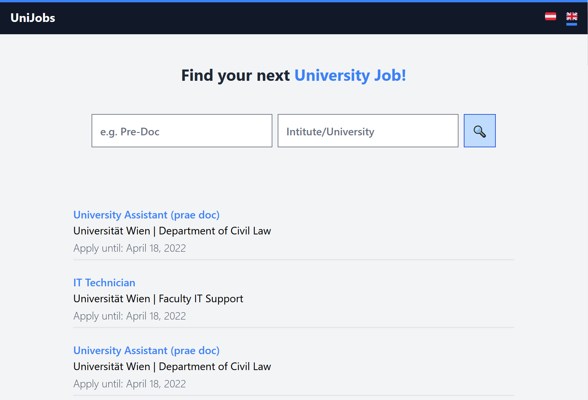

# unijobs - Job Board for University positions

## Goals
- ✔️ Learn Full-Stack Development with Python
- ✔️ Learn Web Scraping
- ✔️ Learn Git Basics
- ❌ MVP for micro-business 

## Project Description

The project started with a specific problem: 

I was looking for a pre-doc job in economics to pursue a PhD. Each week, I checked several university websites for new job postings as most pre-doc jobs weren't advertised on job boards. As a result, I started to scrap the job postings and saved them in a database. Moreover, I wanted to have a website with a simple search form and ideally, bootstrap the website into a small business. 

Unfortunately, I run into many problems: 
-	Web scrapers kept breaking, because university sites changed for no reason and job postings contained errors leading to many edge cases
-	Scraping was a huge pain, due to horrible HTML formats (no css classes, table layouts, inconsistent urls, PDFs…)
-	No viable business model, because universities are frugal and not too many people are interested in academic positions

In the end, I stopped after three universities and changed the scope of the project to be a simple learning demo. 

## Technologies

-	Python **Django** Backend, serving HTML templates
-	Function based views, because they are explicit and more flexible
-	**Tailwind CSS** for styling
-	**htmx** to enhance the frontend and get an “SPA” feeling
-	**SQLite**, many reads and almost no writes. Having a database server would be overkill
-	Python **Playwright** to automate a Chromium instance and scrap websites
-	**Beautiful Soup** to parse the HTML
-	Simple ETL pipeline: Scraper -> JSON -> SQLite

